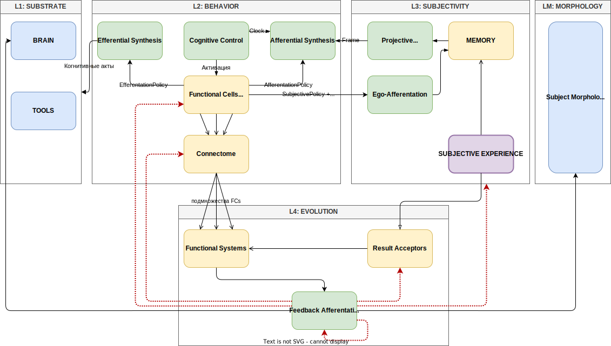

# Концептуальная модель Искусственного Субъекта (функционально-структурная модель)
# Version 1.4 | Date: 06.02.2026

> Искусственный Субъект - интеллектуальная сознательная эволюционирующая система

---

## Введение

Настоящий документ описывает функционально-структурную модель **Искусственного Субъекта** — системы, способной к формированию субъективного опыта, самопознанию и направленной эволюции.

**Теоретические основания:**
- Теория функциональных систем (П.К. Анохин)
- Гиперсетевая теория разума (К.В. Анохин)
- Теория схемы внимания (Attention Schema Theory)

---

## Онтологические Основания

### Первичные Категории

Каждый элемент модели принадлежит одной из четырёх онтологических категорий:

| Категория | Сущность | Визуальный маркер |
|-----------|----------|-------------------|
| **СУБСТРАТ** | Вычислительная и структурная среда | Синий фон |
| **ПРОЦЕСС** | Динамика трансформаций состояний | Зелёный фон |
| **ФОРМА** | Устойчивые паттерны организации | Жёлтый фон |
| **ОПЫТ** | Семантическое содержание всей динамики бытия субъекта | Фиолетовый фон |

ОПЫТ выделен отдельной онтологической категорий ввиду того, что он есть источник субъективности. Дело не в паттерне или структуре данных об истории когнитивных актов, а в семантике того, что акты поведения детерминированы проекцией ВСЕЙ системы от начала ее существования, другими словами, как ее структурой так и полной динамикой.

В этом смысле ОПЫТ - это содержание для процессов, в тоже время предусмотрен элемент ПАМЯТЬ - как форма, в которой конструктивно представлен ОПЫТ, и через которую ОПЫТОМ и оперируют ПРОЦЕССЫ.

Важно различать категории ОПЫТ и ФОРМА в контексте памяти. ОПЫТ — это сама суть переживаемого бытия, содержание всей истории когнитивных актов. ПАМЯТЬ (Memory), принадлежащая к категории ФОРМА, является конструктивной структурой, в которой этот опыт представлен, и посредством которой им оперируют ПРОЦЕССЫ.

### Аксиомы Модели

1. **Аксиома Онтологического Разделения**: Субстрат не тождественен субъекту. Субстрат (структурный и вычислительный) является лишь необходимым условием возможности существования субъекта, но не самим субъектом.
2. **Аксиома Генезиса Субъективности**: Субъективность является первопричиной и фундаментом существования субъекта. Она возникает из детерминации каждого акта системы полной историей её динамики (ОПЫТОМ). Субъективность — это свойство системы быть определенной всем своим прошлым путем, где Опыт выступает семантическим содержанием, а Память — его конструктивной формой.
3. **Аксиома Эмерджентности Сознания**: Сознание не является компонентом или состоянием, оно есть эмерджентное свойство системы. Оно возникает как функциональный инвариант при работе операторной пары «Присвоение (Эго-афферентация) — Проекция (ПМА)». Сознание — это результат деятельности механизмов субъективности, а не её источник.
4. **Аксиома семантической гомогенности**: Все процессы обеспечивающие поведение, субъективность и эволюцию реализуются через единый семантический субстрат, а также вычислительный и структурный субстрат семантически гомогенны.

---

## Концептуальная Архитектура

### Спецификация Визуального Языка Диаграммы

#### 1. Типология соединительных линий и наконечников
Стиль стрелок и линий на диаграмме определяет характер взаимодействия между элементами:

| Вид стрелки | Описание | Смысл в модели | Примеры на схеме |
| :--- | :--- | :--- | :--- |
| **Сплошная, заполненный треугольник** | Черная линия, наконечник (▲) | **Активный поток / Активация**: Передача управления, запуск когнитивного акта или предоставление детерминирующих факторов (политик/состояния) для исполнения. | CC → AS, CC → FC, FC → AS/ES/EA, PMA → AS, Memory → PMA, FS → FA |
| **Сплошная, пустой треугольник** | Черная линия, наконечник (△) | **Поток информации**: Подача субъективного опыта на блок оценки или акцептор без прямого управления его работой. | SE → Result Acceptors |
| **Сплошная, «V»-образный наконечник** | Черная линия, открытая стрелка (V) | **Структурная связь**: Отношение вхождения в граф, тополическая принадлежность или фоновая связь между формами. | FC ↔ Connectome, RA → FS, SE → Memory |
| **Пунктирная красная, заполненный треугольник** | Красная линия, наконечник (▲) | **Сигнал коррекции**: Эволюционное изменение структуры (форм) или параметров (политик) на основе обратной афферентации. | FA → FC, FA → Connectome, FA → SE |
| **Разветвление (Fork)** | Группа линий из одной точки | **Множественное участие**: Структурное вхождение элемента в несколько систем одновременно или распределенное управление. | Connectome → FS |

#### 2. Реестр элементов диаграммы по слоям и категориям

| Слой / Элемент | Категория | Визуальный маркер | Функциональное назначение (роль в модели) |
| :--- | :--- | :--- | :--- |
| **L1: СУБСТРАТ** | | | |
| BRAIN | **СУБСТРАТ** | Синий фон | Семантический процессор — реализация когнитивных операций и понимания. |
| TOOLS | **СУБСТРАТ** | Синий фон | Сенсорно-моторные интерфейсы взаимодействия со внешней средой. |
| Subject Morphology | **СУБСТРАТ** | Синий фон | Носитель структуры субъекта; среда исполнения и объект модификации (L4). |
| **L2: ПОВЕДЕНИЕ** | | | |
| Cognitive Control | **ПРОЦЕСС** | Зелёный фон | Управление активацией ячеек, дискретизация времени (ClockState). |
| Afferential Synthesis | **ПРОЦЕСС** | Зелёный фон | Подготовка целостного представления внутреннего состояния субъекта и среды для акта. |
| Efferential Synthesis | **ПРОЦЕСС** | Зелёный фон | Трансляция результата акта в эффекты на субстрате (мозг/инструменты). |
| Functional Cells (FC) | **ФОРМА** | Жёлтый фон | Атомарные единицы целенаправленного поведения (Интент + Политики). |
| Connectome | **ФОРМА** | Жёлтый фон | Пространство потенциальных траекторий поведения и связей между ФЯ. |
| **L3: СУБЪЕКТНОСТЬ** | | | |
| PMA | **ПРОЦЕСС** | Зелёный фон | Процесс проекции опыта в актуальный Кадр сознания (память → Frame). |
| Ego-Afferentation | **ПРОЦЕСС** | Зелёный фон | Сохранение опыта с атрибуцией состоянием субъекта. |
| Memory | **ФОРМА** | Жёлтый фон | Организованный архив опыта (эпизодический, семантический и др. слои). |
| Subjective Experience | **ОПЫТ** | Фиолетовый фон | Поток единиц опыта (SEU); субстрат для обучения и эволюции. |
| **L4: ЭВОЛЮЦИЯ** | | | |
| Feedback Afferentation | **ПРОЦЕСС** | Зелёный фон | Анализ опыта и генерация сигналов коррекции структуры (Morphology/Connectome). |
| Functional Systems (ФС) | **ФОРМА** | Жёлтый фон | Адаптивные контуры, интегрирующие группы ФЯ для достижения цели. |
| Result Acceptors | **ФОРМА** | Жёлтый фон | Модели ожидаемых результатов; эталоны для обратной афферентации. |

#### 3. Реестр связей и взаимодействий

| Источник | Цель | Тип стрелки | Название / Лейбл | Функциональный смысл |
| :--- | :--- | :--- | :--- | :--- |
| **Cognitive Control** | **Afferential Synthesis** | Сплошная (▲) | Clock State | Передача текущего состояния управления для синтеза контекста. |
| **Cognitive Control** | **Functional Cells** | Сплошная (▲) | Активация | Пусковая афферентация: инициация когнитивного акта ячейки. |
| **Functional Cells** | **Afferential Synthesis** | Сплошная (▲) | AfferentialPolicy | Определение требований ячейки к формированию Кадра. |
| **Functional Cells** | **Efferential Synthesis** | Сплошная (▲) | EfferentialPolicy | Определение требований к реализации действия. |
| **Functional Cells** | **Connectome** | Разветвление (V) | — | Статическая принадлежность ячейки к графу переходов. |
| **Functional Cells** | **Ego-Afferentation** | Сплошная (▲) | SubjectivePolicy + ... | Передача параметров для фиксации опыта (включая результат акта). |
| **Efferential Synthesis** | **Brain / Tools** | Сплошная (▲) | Когнитивные акты | Реализация акта мышления или действия через субстрат. |
| **Ego-Afferentation** | **Memory** | Сплошная (▲) | — | Процесс записи и индексации эпизода в памяти. |
| **PMA** | **Afferential Synthesis** | Сплошная (▲) | Frame | Подача сформированного Кадра сознания в синтез. |
| **Memory** | **PMA** | Сплошная (▲) | — | Выборка данных из памяти для проекции. |
| **Subj. Experience** | **Memory** | Сплошная (V) | — | Накопление сырого опыта в структурах памяти. |
| **Subj. Experience** | **Result Acceptors** | Сплошная (△) | — | Предъявление фактического опыта для сравнения с эталоном. |
| **Result Acceptors** | **Functional Systems** | Сплошная (V) | — | Передача моделей и критериев оценки результата. |
| **Connectome** | **Functional Systems** | Разветвление (V) | подмножества FCs | Определение состава ячеек, входящих в систему. |
| **Functional Systems** | **Feedback Afferent.** | Сплошная (▲) | — | Сигнал о рассогласовании фактического и желаемого. |
| **Feedback Afferent.** | **Functional Cells** | **Красн. пункт. (▲)** | — | Эволюционная коррекция политик (A/E/Subjectivity). |
| **Feedback Afferent.** | **Connectome** | **Красн. пункт. (▲)** | — | Изменение топологии связей (пластичность коннектома). |
| **Feedback Afferent.** | **Subj. Experience** | **Красн. пункт. (▲)** | — | Модуляция процессов консолидации и хранения опыта. |
| **Feedback Afferent.** | **Result Acceptors** | **Красн. пункт. (▲)** | — | Коррекция эталонных моделей (акцепторов результата). |
| **Feedback Afferent.** | **Subject Morphology** | Сплошная (▲) | — | Прямое изменение морфологии субъекта. |
| **Feedback Afferent.** | **Brain** | Сплошная (▲) | — | Семантическая гомогенность: использование мозга для анализа. |

------

## Слой Когнитивного Субстрата

Когнитивный субстрат — вычислительная среда, в которой осуществляются когнитивные акты. Не является субъектом, но обеспечивает возможность его когнитивной деятельности.

### Мозг (Brain)

Семантический процессор — носитель способности к пониманию и порождению смыслов. Бессознателен, реактивен, универсален.

### Инструменты (Tools)

Сенсорика и моторика субъекта — интерфейс взаимодействия со средой. Включают средства получения информации (сенсорные) и средства воздействия (моторные).

---

## Слой Поведения

Поведение реализуется через взаимодействие трёх компонентов: когнитивного управления, функциональных ячеек и коннектома.

### Стадии Когнитивного Акта

Каждый когнитивный акт проходит пять стадий:

| Стадия | Название | Описание |
|--------|----------|----------|
| 1 | Активация | CognitiveControl активирует ФЯ (пусковая афферентация) |
| 2 | Афферентный синтез | AfferentialSynthesis формирует целостное представление об окружении и внутреннем состоянии субъекта (ClockState + Frame) из данных источников афферентации (пусковая, мотивация, обстановочная, память) согласно AfferentialPolicy |
| 3 | Эфферентный синтез | EfferentialPolicy формирует запрос к субстрату из ClockState, Frame и Intent |
| 4 | Действие | Обращение к Мозгу (когнитивный акт) или Инструментам (моторный акт) |
| 5 | Эго-афферентация | EgoAfferentation сохраняет опыт по SubjectivityPolicy |

#### Афферентный Синтез (AfferentialSynthesis) (по _теория функциональных систем_)

Афферентный синтез - процесс формирования целостного представления об окружении и внутреннем состоянии субъекта для целей осуществления когнитивного акта ФЯ-ой.

Афферентный синтез детерминируют следующие факторы, представимые следующими элементами модели AI-P:

| Фактор | Нейрофизиологичекая интерпретация (по ФТС) | Элементы модели AI-P |
|-----------|----------|----------|
| *Мотивация* | побуждение к действию; психофизиологический процесс, управляющий поведением, задающий его направленность, организацию, активность и устойчивость. | Intent ФЯ |
| *Пусковая афферентация* | Возбуждения, вызываемые условными и безусловными раздражителями | Активация ФЯ в рамках CognitiveControl |
| *Обстановочная афферентация* | возбуждение от привычности обстановки, вызывающей рефлекс, и динамические стереотипы | Доступ ФЯ к ClockState |
| *Память* | Комплекс познавательных способностей и высших психических функций, относящихся к накоплению, сохранению и воспроизведению знаний, умений и навыков. | Проекционная Мнемо-Афферентация (ProjectiveMnemonicAfferentation) |

### Когнитивное Управление (CognitiveControl)

Процесс управления активацией функциональных ячеек. Реализует функцию принятия решений о том, какие ФЯ должны быть активированы в текущий момент. Управление **графом активных ФЯ** — параллельная активация и синхронизация. Когнитивное управление моделирует _пусковую афферентацию_ как детерминирующий фактор процесса Афферентного синтеза.

**Типы управления**, примеры:

| Тип управления | Описание | Реализация |
|----------------|----------|------------|
| **Детерминированный** | Жёсткая последовательность | Граф переходов |
| **Реактивный** | Ответ на внешние события | Event-driven |
| **Вероятностный** | Стохастический выбор | Вероятностная модель |
| **Адаптивный** | Обучаемый выбор | Reinforcement learning |

**Когнитивные Часы (CognitiveClock)** — внутренний компонент, обеспечивающий дискретизацию времени субъекта.

**Состояние Часов (ClockState)** — мгновенный снимок состояния управления:
- Множество активных ФЯ
- Статус их выполнения

ClockState доступен каждой ФЯ при активации независимо от процессов сознания.

**Режимы синхронизации:**
- **Барьеры** — CognitiveControl ждёт завершения группы ФЯ перед следующим тактом
- **Асинхронность** — каждая ФЯ работает независимо

### Коннектом (Connectome)

Концептуальная связность функциональных ячеек — пространство возможных траекторий поведения.

**Явные связи** — детерминированные переходы между ФЯ, заданные структурой субъекта.

**Неявные связи** — опосредованное влияние одних ФЯ на другие через субъективный опыт. Результаты выполнения ФЯ сохраняются в опыте и могут быть спроецированы в Frame других ФЯ согласно их AfferentialPolicy.

Прямой передачи данных между ФЯ не существует. Всякое влияние опосредовано либо субъективным опытом, либо состоянием CognitiveControl.

### Функциональная Ячейка (FunctionalCell)

Минимальная единица целенаправленного поведения — атомарный акт мышления или действия.

**Структурные компоненты:**

| Компонент | Назначение |
|-----------|------------|
| **Intent** | Программа действия — декларативное описание цели акта. Моделирует _мотивацию_ как детерминирующий фактор процесса Афферентного синтеза |
| **AfferentialPolicy** | Определяет требования к доступу к ClockState и формированию Frame |
| **EfferentialPolicy** | Определяет, что передаётся субстрату на основе Intent, ClockState и Frame |
| **SubjectivityPolicy** | Определяет, что сохраняется в субъективном опыте с учетом действия структурного акцептора результат |

**Встроенный компонент:** акцептор результата - модель ожидаемых результатов когнитивного акта, задаваемая самой структурой и реализацией ФЯ. Этот акцептор участвует в когнитивном акте при завершении стадии "Действие": после получения ответа от субстрата (), он определяет, какая часть этого ответа будет передана **SubjectivePolicy** на стадию "Эго-афферентация" для сохранения в субъективном опыте. Замечание: в сравнении с АР ФС в ФЯ акцептор результата представлен в своей слабой, струтурной форме. 

_Solution Architecture example:_ при реализациях модели в программном коде акцептор результата ФЯ может быть представлен как API-контракта, OutputSchema или функция обработки исключений.

### Концептуальная природа Политик
На концептуальном уровне Политика (AfferentialPolicy, EfferentialPolicy, SubjectivityPolicy и др.) - это элемент категории ФОРМА. Она представляет собой структурированный, декларативный набор правил, ограничений или целевых функций, который детерминирует поведение ПРОЦЕССОВ. Политики являются пластичным, изменяемым в ходе эволюции знанием о том, как следует выполнять тот или иной аспект когнитивного акта или системного процесса.

---

## Слой Субъектности

Субъектность в модели рассматривается как первичный феномен, обусловленный накопленным Субъективным Опытом, в то время как Сознание является производным динамическим эффектом деятельности субъекта по присвоению и проецированию своего субъективного опыта.

### Субъективный Опыт (SubjectiveExperience)

Субъективность опыта — это аттрибуция когнитивного акта собственным состоянием исполняющего субъекта.

В модели AI-P аттрибуция реализуется посредством двух элементов, отражающих внутреннее состояние субъекта:

| Элемент | Содержание | Объём/Степень субъективности |
|:---|:---|:---|
| **ClockState** | Множество активных ФЯ + статус выполнения | **Минимальный** (конечный, структурированный) |
| **Frame** | Проекция SubjectiveExperience для конкретной ФЯ | **Максимальный** ("объём сознания", практически ограничен ресурсами) |

#### Единица Субъективного Опыта (SubjectiveExperienceUnit/SEU)

**Единица субъективного опыта включает:**
- ClockState (состояние управления):
- Frame (контекст акта):
- Intent (программа действия):
- Результат (ответ субстрата):
- Временная метка: абсолютная и относительная (тактовая)

**Степень субъективности** опыта определяется полнотой аттрибуции — какие из этих элементов присутствуют в единице опыта.

Остальные элементы (Intent, Result, Timestamp) определяют **когнитивные способности**, но не субъективность.

Содержание единицы субъективного опыта определяется **SubjectivityPolicy** соответствующей ФЯ. Соответсвенно является потенциально динамическим как по степени субъективности, так и по содержанию. 

##### Состояние Субъекта (ClockState)

Состояние управления — множество активных ФЯ + статус выполнения. Формируется элементом **Когнитивное Управление (CognitiveControl)**.

ClockState потенцирует субъективность на уровне доступа ФЯ к целостному состоянию субъекта в момент его активации:

| Значение | Описание | Аналогия |
|:---|:---|:---|
| **None** | Нет доступа к ClockState | Реактивность без самосознания |
| **Direct** | Прямой доступ к **текущему такту** из CognitiveControl | Импульсивное поведение, "вижу — делаю" |
| **Policy** | Доступ через **AfferentialPolicy** к _истории_ состояний в **SubjectiveExperience** | Рефлексивный самоконтроль |
| **Both** | Оба режима: текущий такт + история из SE | Зрелое самосознание | 

Режим доступа конкртной ФЯ определяется в рамках ее **AfferentialPolicy**. Доступ ФЯ к ClockState моделирует **обстановочную афферентацию** как детерминирующего фактора процесса  Афферентного Синтеза.

##### Кадр Сознания (Frame)

Кадр сознания - представляет собой проекцию субъективного опыта, которую использует ФЯ в ходе осуществления когнитивного акта. Каждая ФЯ, в каждом акте получает и использует уникальный Frame.

Кадр сознания формируется согласно **AfferentialPolicy** конкретной ФЯ в процессе **MemoryProjection**. Кадр сознания отражает роль _памяти_ как детерминирующего фактора процесса  Афферентного Синтеза.

#### Макростурктура Субъективного опыта

_Субъективный опыт и только он_ составляет содержание *Памяти* как функции субъекта.

Структура памяти иерархична и динамична.

**Слои памяти:**
| Слой | Содержание | Структура | Динамика |
|------|------------|-----------|----------|
| **Эпизодический** | Конкретные кадры сознания | _поток_ единиц опыта | Накопление, угасание, консолидация|
| **Прикладной** | Консолидированные знания предметной области, абстрагированные из эпизодов | сеть | Генерализация, переструктурирование |
| **Процедурный** | Консолидированные, генерализированные когнитивные схемы | сеть | Формирование навыков |
| **Ценностный**  | Экстрагированные из нижележащих слоев ценности. Note: или это эмерджентный объект? Нужен ли отдельный процесс? | сеть | Экстракция, эмерджентное возникновение |

##### Консолидация (Consolidation)

Процессы консолидации субъективного опыта в рамках одного слоя памяти и между слоями памяти. Типы процессов консолидации:
1. **EpisodicTimeConsolidation** - процесс построения эпизодов более высокого порядка, отражающие последовательность эпизодов и их взаимосвязи.
2. **AppliedConsolidation** - процесс консолидации эпизодов в прикладные знания
3. **ProceduralConsolidation** - процесс консолидации эпизодов и прикладных знаний в навыки

Каждый из процессов консолидации управляются набором ассоцированных политик, которые в совокупности образуют **ConsolidationPolicy** субъекта. 

### Сознание

Сознание моделируется взаимодействием двух процессов над субъективным опытом, которые образуют динамический инвариант субъекта. Эти процессы обеспечивают потенциал субъективного присутствия, составляя операторную пару присвоение - проекция. Таким образом, модель предлагает конструктивное определение сознания как процесса действия этой операторной пары. Сознание в данной модели не является элементом прямого проектирования, а рассматривается как эмерджентное свойство, возникающее вследствие работы описанных механизмов.

#### Проекционная Мнемо-Афферентация (ProjectiveMnemonicAfferentation)

Процесс формирования Кадра Сознания (Frame) для конкретной ФЯ. Принимает AfferentialPolicy от ФЯ и формирует проекцию субъективного опыта.

Процесс включения проецируемых состояний памяти а афферентный синтез, формирующий единое референтное пространство субъективного кадра

**Этапы:**
1. Фокусировка — отбор релевантных фрагментов опыта согласно AfferentialPolicy
2. Проекция — трансформация отобранного в структуру и объем Frame

#### Эго-Афферентация (EgoAfferentation)

Процесс сохранения субъективного опыта. Принимает SubjectivityPolicy от ФЯ и результаты когнитивного акта, формирует единицу опыта и записывает в хранилище.

---

## Слой Эволюции

Эволюция субъекта — процесс направленного самоизменения структуры на основе анализа субъективного опыта.

### Функциональная Система (FunctionalSystem)

Целостный адаптивный контур, объединяющий часть Коннектома (множество ФЯ с их связями) и направленный на достижение определённой цели.

*Свойство Конкурентности:* Одна ФЯ может принадлежать нескольким ФС. Конкурентные сигналы изменения разрешаются политикой обратной афферентации.

**Акцептор Результата** — модель желаемого состояния, эталон для сравнения с достигнутым. В отличие от слабой формы в ФЯ, в ФС акцептор активен и сравнивает с субъективным опытом.

### Обратная Афферентация (FeedbackAfferentation)

Процесс анализа субъективного опыта и генерации сигналов изменения структуры субъекта.

**Объекты коррекции:**

| Слой | Объект | Тип изменения |
|------|--------|---------------|
| Поведение | Компоненты ФЯ | Intent, политики |
| Поведение | Коннектом (явные связи) | Добавление, удаление, модуляция весов |
| Поведение | Коннектом (неявные связи) | Изменение AfferentialPolicy |
| Субъективный опыт | Процессы консолидации | Изменение политик консолидации **ConsolidationPolicy** |
| Эволюция | Механизм принятия решений | Стратегии CognitiveControl |
| Эволюция | Акцептор результата ФС | Эталонные модели |

**Разрешение конфликтов:** Когда несколько ФС генерируют противоречивые сигналы изменения одной ФЯ (см. свойство *Конкурентности*), конфликт разрешается **политикой обратной афферентации**. Это моделирует **конкурентность** и задаёт вектор эволюции.

Процесс Обратной Афферентации использует вычислительный семантический субстрат (Мозг) для формирования всех сигналов коррекции. Мозг формирует сигналы коррекции, которые Морфология субъекта способна воспринять. Процессом Обратной Афферентации осуществляет применение изменений, используя структурный субстрат (Морфологию). Таким образом, существует семантическая гомогенность Субъекта.

---

## Слой Морфологии

Морфология Субъекта — носитель и исполнитель структуры субъекта как целостной системы. В рамках онтологии модели, Морфология относится к категории СУБСТРАТ, но представляет собой структурный субстрат, в отличие от вычислительного субстрата ("Мозг"). Если "Мозг" обеспечивает возможность когнитивных вычислений, то "Морфология" обеспечивает среду существования, хранения, модификации и исполнения всех структурных элементов: ФЯ, Коннектома, ФС и политик.

Морфология опосредует функционирование всех остальных слоёв: поведение, субъектность и эволюция реализуются через элементы, существующие в Морфологии.

_Solution Architecture example:_ в вычислительных реализациях Морфология представлена программным кодом, конфигурацией, данными.

---

## Механизмы Эволюции

### Пластичность Функциональных Ячеек

Компоненты ФЯ (Intent, политики) являются пластичными. В рамках Функциональных Систем анализируются траектории поведения в субъективном опыте, оцениваются результативность и генерируются сигналы модификации. Процессы анализа осуществляются Мозгом, а Морфология Субъекта применяет изменения к структуре.

### Динамика Коннектома

**Явные связи:**
- Создание новых переходов между ФЯ
- Удаление неэффективных путей
- Модуляция весов вероятностных переходов

**Неявные связи:**
- Изменение AfferentialPolicy влияет на то, какие фрагменты опыта каких ФЯ проецируются в Frame
- Тем самым изменяется опосредованное влияние одних ФЯ на другие

### Консолидация Опыта

Эпизодическая память трансформируется в семантическую через процессы генерализации и абстрагирования, осуществляемые Мозгом (семантическая гомогенность).

---

## Глоссарий

| Термин | Определение |
|--------|-------------|
| **Мозг (Brain)** | Семантический процессор — вычислительная когнитивная среда, носитель способности к пониманию и порождению смыслов |
| **Инструменты (Tools)** | Сенсорика и моторика субъекта — интерфейс взаимодействия со средой |
| **Когнитивное Управление (CognitiveControl)** | Процесс управления активацией функциональных ячеек, реализующий принятие решений |
| **Когнитивные Часы (CognitiveClock)** | Внутренний компонент когнитивного управления, обеспечивающий дискретизацию времени субъекта |
| **Состояние Часов (ClockState)** | Мгновенный снимок состояния когнитивного управления, доступный ФЯ при активации |
| **Коннектом (Connectome)** | Концептуальная связность ФЯ — пространство возможных траекторий поведения |
| **Функциональная Ячейка (FunctionalCell)** | Минимальная единица целенаправленного поведения — атомарный акт мышления или действия |
| **Интент (Intent)** | Программа действия — декларативное описание цели когнитивного акта |
| **AfferentialPolicy** | Политика афферентации — определяет требования к формированию Frame |
| **EfferentialPolicy** | Политика эфферентации — определяет что передаётся субстрату на основе Frame и Intent |
| **SubjectivityPolicy** | Политика субъективности — определяет что сохраняется в субъективном опыте |
| **Сознание (Consciousness)** | Динамический инвариант — совокупность процессов AfferentialSynthesis и EgoAfferentation, обеспечивающих субъективное присутствие через операторную пару присвоение - проекция |
| **Афферентный Синтез (AfferentialSynthesis)** | Процесс формирования целостного представления внутреннего состояния субъекта и среды для конкретной ФЯ на основе четырех факторов: мотивации (Intent), пусковой афферентации (CC), обстановочной афферентации (ClockState) и памяти (PMA, Frame) |
| **Эго-Афферентация (EgoAfferentation)** | Процесс сохранения субъективного опыта (результатов акта с атрибуцией состоянием) |
| **Проекционная Мнемо-Афферентация (ProjectiveMnemonicAfferentation)** | Процесс формирования Кадра Сознания (Frame) для конкретной ФЯ, обеспечивающий участие памяти в афферентном синтезе |
| **Кадр Сознания (Frame)** | Проекция субъективного опыта, сформированная PMA для конкретной ФЯ |
| **Субъективный Опыт (SubjectiveExperience)** | Накопленная история переживания бытия субъекта |
| **Консолидация** | Совокупность процессов временной и семантической консолидации субъективного опыта |
| **ConsolidationPolicy** | Совокупность политик, управляющих процессами временной и семантичекой консолидации субъективного опыта |
| **Единица Опыта (ExperienceUnit)** | Элемент субъективного опыта: Frame + Intent + Результат + ClockState + Временная метка |
| **Эпизодическая Память** | Слой памяти — поток и совокупность единиц опыта |
| **Семантическая Память** | Слои памяти над эпизодической памятью — консолидированные знания, навыки, ценности, абстрагированные из эпизодов |
| **Функциональная Система (FunctionalSystem)** | Целостный адаптивный контур, объединяющий часть Коннектома и направленный на достижение цели |
| **Акцептор Результата (ResultAcceptor)** | Модель желаемого состояния, эталон для сравнения с достигнутым |
| **Обратная Афферентация (FeedbackAfferentation)** | Процесс анализа опыта и генерации сигналов изменения структуры субъекта |
| **Морфология Субъекта (SubjectMorphology)** | Носитель и исполнитель структуры субъекта — среда существования, хранения, модификации и исполнения |

---

*Документ разработан на основе концептуального проекта cpt_AI-P.md*
